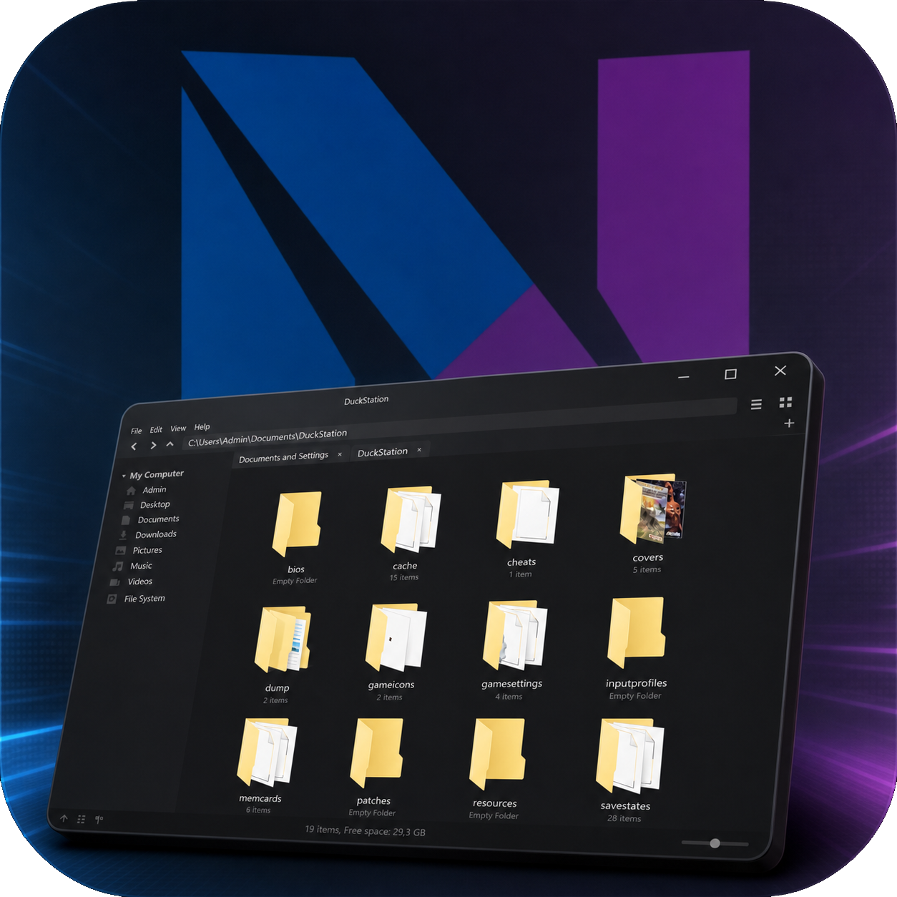

  

<h1 align="center">DotNetFM</h1>

  <strong>A modern, Linux-inspired file manager for Windows — built from scratch with C# and WPF.</strong>

  
  
  
  
  
  

---

## What is DotNetFM?

DotNetFM is a lightweight, fast, and visually polished file manager for Windows. It draws deep inspiration from **[GNOME Nautilus](https://wiki.gnome.org/Apps/Files)** and the broader Linux desktop ecosystem, bringing that clean, purposeful design language to the Windows platform.

Every pixel, every interaction, and every component is **built from the ground up** — no bloated UI frameworks, no third-party file manager shells. Just pure **C#**, **WPF**, and a lot of Win32 interop where Windows demands it.

## Why?

Most Windows file managers are either stuck in the Windows 7 era or packed with features nobody asked for. DotNetFM takes a different approach: a **minimal, focused file manager** that feels right at home on a modern desktop, borrowing the best ideas from the Linux world while embracing native Windows capabilities under the hood.

## License

This project is licensed under the [MIT License](LICENSE).

---