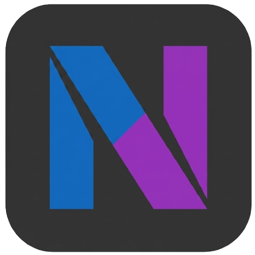

<p align="center">
  
</p>

<h1 align="center">DotNetFM</h1>

<p align="center">
  <strong>A modern, Linux-inspired file manager for Windows — built from scratch with C# and WPF.</strong>
</p>

<p align="center">
  
  
  
  
  
  
</p>

---

## What is DotNetFM?

DotNetFM is a lightweight, fast, and visually polished file manager for Windows. It draws deep inspiration from **[GNOME Nautilus](https://wiki.gnome.org/Apps/Files)** and the broader Linux desktop ecosystem, bringing that clean, purposeful design language to the Windows platform.

Every pixel, every interaction, and every component is **built from the ground up** — no bloated UI frameworks, no third-party file manager shells. Just pure **C#**, **WPF**, and a lot of Win32 interop where Windows demands it.

## Why?

Most Windows file managers are either stuck in the Windows 7 era or packed with features nobody asked for. DotNetFM takes a different approach: a **minimal, focused file manager** that feels right at home on a modern desktop, borrowing the best ideas from the Linux world while embracing native Windows capabilities under the hood.

## Features

| Feature                        | Description                                                                           |
| ------------------------------ | ------------------------------------------------------------------------------------- |
| **Multi-Tab Browsing**         | Open multiple directories in tabs — just like a browser, but for your files.          |
| **Linux-Inspired Sidebar**     | Configurable sidebar with bookmarks, system directories, and drag-to-reorder support. |
| **Dark Theme**                 | A carefully crafted dark UI, fully configurable via JSON — no XAML editing required.  |
| **Native Context Menus**       | Real Windows shell context menus via COM interop — not a cheap imitation.             |
| **Drag & Drop**                | Full drag-and-drop support for moving and copying files.                              |
| **Rubber Band Selection**      | Click and drag to select multiple items — exactly how you'd expect it to work.        |
| **Zoom Slider**                | Smooth icon size adjustment from tiny thumbnails to large previews.                   |
| **Asynchronous Icon Loading**  | Icons load in the background without freezing the UI — even for thousands of files.   |
| **SVG Icons**                  | Vector-based sidebar and UI icons rendered via SharpVectors.                          |
| **Directory Watching**         | Auto-refreshes when files change on disk.                                             |
| **Renaming & File Operations** | Rename, delete (to Recycle Bin), copy, cut, and paste — with inline rename support.   |
| **Breadcrumb Address Bar**     | Type a path or click to navigate — with keyboard shortcuts.                           |
| **Configurable Everything**    | Sidebar layout, theme colors, spacing, fonts — all driven by JSON config files.       |

## Getting Started

### Prerequisites

- **Windows 10/11**
- **[.NET 8 SDK](https://dotnet.microsoft.com/download/dotnet/8.0)** or later

### Build & Run

```bash
# Clone the repository
git clone https://github.com/rilex037/dot-net-fm.git
cd dot-net-fm

# Build
dotnet build dot-net-fm.csproj

# Run
dotnet run --project dot-net-fm.csproj
```

Or open `dot-net-fm.csproj` directly in **Visual Studio 2022** and hit **F5**.

## Project Structure

```
dot-net-fm/
├── Assets/
│   └── Icons/              # SVG icons for sidebar & UI
├── Config/
│   ├── sidebar-config.json # Sidebar layout & bookmarks
│   └── theme-config.json   # Colors, spacing, fonts, sizing
├── src/
│   ├── Controls/           # WPF UserControls (FileGridView, SidebarPanel, NavigationToolbar, etc.)
│   ├── Definitions/        # Command IDs & constants
│   ├── Helpers/            # Native Win32 interop, icon loading, utilities
│   ├── Models/             # FolderItem, SidebarItem data models
│   ├── Properties/         # Assembly info
│   ├── Services/           # Core logic (Navigation, Tabs, Clipboard, DragDrop, Theming, etc.)
│   └── Windows/            # App.xaml, MainWindow
├── DotNetFM.png            # Project banner
└── dot-net-fm.csproj       # Project file
```

## Architecture

DotNetFM follows a **service-oriented architecture** with clear separation of concerns:

- **`TabStore`** / **`TabReducer`** — State management for each tab, inspired by Redux-style reducers.
- **`NavigationService`** — Handles directory traversal, back/forward history, and async file listing.
- **`FileInteractionService`** — Orchestrates user interactions: click, rename, delete, copy, cut, paste.
- **`ThemeService`** — Loads and applies the full theme from `theme-config.json` at startup.
- **`SidebarService`** — Manages sidebar sections, bookmarks, and path resolution.
- **`ShellContextMenuService`** — Direct COM interop with the Windows Shell for native context menus.
- **`DirectoryWatcherService`** — File system change monitoring with debounced notifications.

## Configuration

### Theme (`Config/theme-config.json`)

Customize colors, spacing, fonts, border radii, and sizing — all from a single JSON file. No XAML editing needed.

### Sidebar (`Config/sidebar-config.json`)

Define sections, items, icons, and bookmarks. Paths support environment variables like `%USERPROFILE%`.

## Tech Stack

- **Language:** C# 12
- **UI Framework:** WPF (.NET 8)
- **Icon Rendering:** [SharpVectors](https://github.com/ElinamLLC/SharpVectors) for SVG support
- **Native Interop:** Win32 API via P/Invoke for shell menus, icons, and monitor info

## Roadmap

- [ ] Path bar breadcrumb click-to-navigate
- [ ] File search / filter
- [ ] Split view (dual pane)
- [ ] File previews panel
- [ ] Keyboard shortcut customization
- [ ] Linux file manager–style app grid launcher
- [ ] Localization support

## License

This project is licensed under the [MIT License](LICENSE).

---

<p align="center">
  Built with ❤️ using C# and WPF — because Windows deserves a better file manager.
</p>
